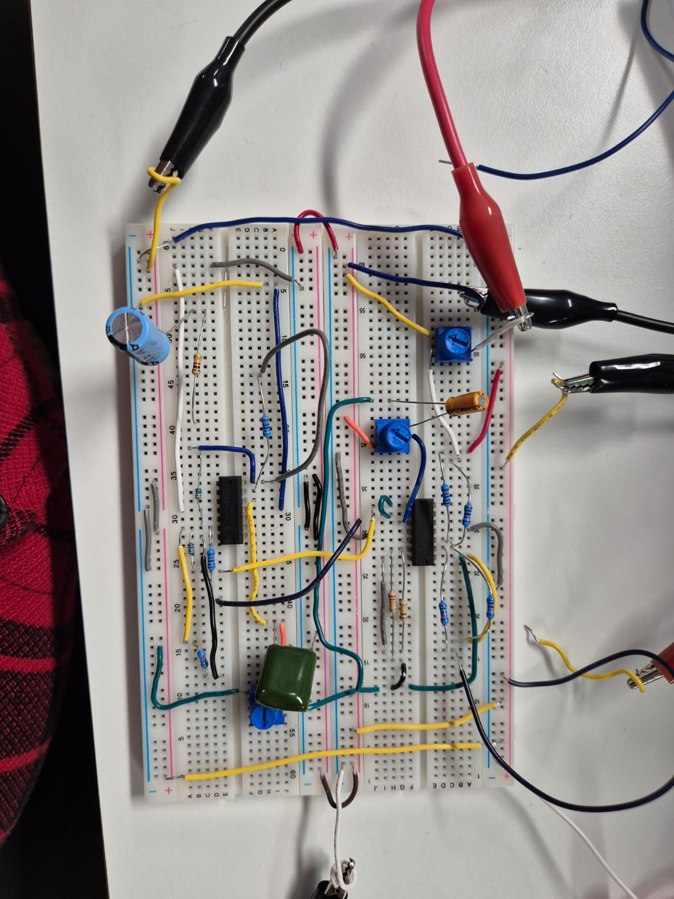

<h3>🔌 PCB Design Project</h3>

- <b><a href="https://github.com/WaleedUmer357/PID-Controller-">PID Controller</a></b>
  - Professional analog PID controller with TL072P operational amplifiers
  - <a href="5336317_Waleed_UMER_PID_Controller.pdf">Documentation</a> | <a href="Images/PCB_schematic.pdf">Schematic</a> | <a href="PCB.png">PCB Layout</a>

  

  
🎨 Click to view Project Details

   
  
  <h4>🚀 Project Overview</h4>
  
This project showcases a professional analog PID (Proportional-Integral-Derivative) controller circuit designed and implemented using TL072P operational amplifiers. The controller was developed as part of Practical Electronics coursework at Griffith University, featuring comprehensive design, simulation, breadboard prototyping, and final PCB implementation. The system demonstrates precise control system principles with detailed analysis of P, PI, PD, and PID behaviors under various signal conditions.

  
  <h4>✨ Key Features</h4>
  <ul>
    <li><b>Controller Type:</b> Analog PID Controller with adjustable parameters</li>
    <li><b>Operational Amplifiers:</b> TL072P Low-Noise JFET Op-Amps for high precision</li>
    <li><b>Frequency Range:</b> 5Hz to 20kHz operational range</li>
    <li><b>Control Stages:</b> Independent Proportional, Integral, and Derivative circuits</li>
    <li><b>Adjustability:</b> Trimpot potentiometers for real-time tuning</li>
    <li><b>Test Points:</b> Multiple test points for signal monitoring and analysis</li>
  </ul>
  
  <h4>🎯 Design Implementation</h4>
  
  
<b>🔧 Circuit Stages Design</b>

  <ul>
    <li><b>Proportional Stage:</b> Gain Kp = 10 with trimpot adjustment capability</li>
    <li><b>Integral Stage:</b> Low-pass filter with cutoff frequency = 800Hz, Ki = 1</li>
    <li><b>Derivative Stage:</b> High-pass filter with Kd = 1 for rate-of-change response</li>
    <li><b>Summation Stage:</b> Standardized 1KΩ resistors with overall gain of 10</li>
    <li><b>Difference Amplifier:</b> Unit gain stage for error signal processing</li>
  </ul>
  
  
<b>⚡ Power Requirements</b>

  <ul>
    <li>Dual power supply: ±12V to ±15V operation</li>
    <li>Low power consumption JFET input op-amps</li>
    <li>Stable operation across temperature variations</li>
  </ul>
  
  
<b>📊 Signal Processing Capabilities</b>

  <ul>
    <li>Handles square, triangular, and sinusoidal waveforms</li>
    <li>Real-time error correction with minimal phase shift</li>
    <li>Overshoot and undershoot control through tuning</li>
    <li>Steady-state error elimination via integral action</li>
  </ul>
  
  <h4>🔬 Testing & Performance Analysis</h4>
  
  
<b>📈 Controller Behaviors Demonstrated</b>

  
  <table>
    <tr>
      <td><b>Controller Type</b></td>
      <td><b>Performance Characteristics</b></td>
      <td><b>Applications</b></td>
    </tr>
    <tr>
      <td>Proportional (P)</td>
      <td>Fast response, steady-state error, oscillations</td>
      <td>Simple systems, coarse control</td>
    </tr>
    <tr>
      <td>Proportional-Integral (PI)</td>
      <td>Eliminates steady-state error, overshoot issues</td>
      <td>Temperature control, level control</td>
    </tr>
    <tr>
      <td>Proportional-Derivative (PD)</td>
      <td>Reduces overshoot, system damping, undershoot</td>
      <td>Motor control, positioning systems</td>
    </tr>
    <tr>
      <td>Full PID</td>
      <td>Optimal response, minimal error, stability</td>
      <td>Precision control systems</td>
    </tr>
  </table>
  
  
<b>🎛️ Tuning Methodology</b>

  <ul>
    <li>Manual tuning via potentiometers for each stage</li>
    <li>Oscilloscope monitoring of reference vs. output signals</li>
    <li>Iterative adjustment for optimal response</li>
    <li>Frequency response analysis from 5Hz to 20kHz</li>
  </ul>
  
  <h4>🖼️ Design Gallery</h4>
  
  
<b>📋 Complete Schematic Design</b>

  
Professional schematic showing all PID stages with component values and signal flow. Designed in Altium Designer with clear functional blocks.

  
  
  
<b>🔌 PCB Layout - Top View</b>

  
Clean, professional PCB layout with optimized component placement. Single-sided design for easy manufacturing and assembly.

  
  
  
<b>⚡ Circuit Implementation</b>

  
Detailed view of the analog PID circuit implementation with operational amplifiers, resistors, capacitors, and tuning potentiometers.

  
  
  
<b>🧪 Breadboard Prototype</b>

  
Initial breadboard implementation used for circuit validation and parameter tuning before PCB fabrication.

  
<i>Refer to Figure 3.3 in documentation</i>

  
  <h4>📐 Technical Specifications</h4>
  <table>
    <tr>
      <td><b>Operational Amplifiers</b></td>
      <td>TL072P (x2), TL074 (x1)</td>
    </tr>
    <tr>
      <td><b>Power Supply</b></td>
      <td>±12V to ±15V DC</td>
    </tr>
    <tr>
      <td><b>Frequency Range</b></td>
      <td>5Hz - 20kHz</td>
    </tr>
    <tr>
      <td><b>Proportional Gain</b></td>
      <td>Kp = 10 (adjustable)</td>
    </tr>
    <tr>
      <td><b>Integral Time</b></td>
      <td>Ti = 1/(2π×800) seconds</td>
    </tr>
    <tr>
      <td><b>Derivative Time</b></td>
      <td>Td = 1/(2π×cutoff) seconds</td>
    </tr>
    <tr>
      <td><b>PCB Dimensions</b></td>
      <td>Approx. 80mm x 60mm</td>
    </tr>
    <tr>
      <td><b>PCB Layers</b></td>
      <td>Single-sided with ground plane</td>
    </tr>
    <tr>
      <td><b>Connectors</b></td>
      <td>4-pin headers for I/O and power</td>
    </tr>
  </table>
  
  <h4>📊 Performance Results</h4>
  
  
<b>✅ Successful Outcomes</b>

  <ul>
    <li>Full PID functionality achieved with all control modes</li>
    <li>Effective error correction for various input waveforms</li>
    <li>Stable operation across specified frequency range</li>
    <li>Minimal overshoot with proper tuning (＜10%)</li>
    <li>Steady-state error elimination via integral action</li>
  </ul>
  
  
<b>⚠️ Identified Limitations</b>

  <ul>
    <li>Frequency response limited to 20kHz maximum</li>
    <li>Low-frequency behavior resembles P-only controller below 5Hz</li>
    <li>Triangular/sinusoidal signals limited to 300Hz for full PID action</li>
    <li>Requires external load for practical applications</li>
  </ul>
  
  <h4>🔮 Applications</h4>
  <ul>
    <li><b>Temperature Control Systems:</b> HVAC, industrial process control</li>
    <li><b>Motor Speed Control:</b> DC motor speed regulation, conveyor systems</li>
    <li><b>Process Control:</b> Chemical reactors, distillation columns</li>
    <li><b>Educational Tool:</b> Control systems laboratory experiments</li>
    <li><b>Prototyping Platform:</b> PID algorithm testing and validation</li>
  </ul>
  
  <h4>📈 Comparative Analysis</h4>
  
  
<b>PID vs. Other Controllers</b>

  <ul>
    <li><b>vs. P-only:</b> PID eliminates steady-state error and reduces oscillations</li>
    <li><b>vs. PI:</b> PID adds derivative action to reduce overshoot and improve stability</li>
    <li><b>vs. PD:</b> PID includes integral action to eliminate steady-state error</li>
    <li><b>Overall:</b> PID provides balanced response with fastest settling time</li>
  </ul>
  
  <h4>🔧 Design Tools & Methodology</h4>
  <ul>
    <li><b>Simulation:</b> Proteus for initial circuit validation</li>
    <li><b>Schematic Capture:</b> Altium Designer for professional schematic design</li>
    <li><b>PCB Layout:</b> Altium Designer with design rule checking</li>
    <li><b>Prototyping:</b> Breadboard for initial testing and parameter tuning</li>
    <li><b>Testing:</b> Oscilloscope for waveform analysis and performance validation</li>
  </ul>
  
  <h4>📦 Project Files</h4>
  <ul>
    <li><b>Complete Documentation:</b> <a href="5336317_Waleed_UMER_PID_Controller.pdf">PID Controller Report (PDF)</a></li>
    <li><b>Schematic:</b> <a href="PCB_schematic.pdf">Altium Schematic</a></li>
    <li><b>PCB Layout:</b> <a href="PCB.png">Manufacturing-ready Layout</a></li>
    <li><b>Circuit Diagram:</b> <a href="PCB design.jpeg">Detailed Circuit Implementation</a></li>
    <li><b>Bill of Materials:</b> Included in documentation (page 4)</li>
  </ul>
  
  <h4>💡 Future Improvements</h4>
  <ul>
    <li>Implement digital PID control using microcontroller</li>
    <li>Add auto-tuning capability for different loads</li>
    <li>Extend frequency range with higher-order filters</li>
    <li>Include load driver stage for motor/actuator control</li>
    <li>Develop graphical user interface for parameter adjustment</li>
    <li>Implement adaptive PID for varying system dynamics</li>
  </ul>
  
  <h4>📚 References</h4>
  <ol>
    <li>Åström, K. J., & Murray, R. M. (2008). Feedback Systems: An Introduction for Scientists and Engineers. Princeton University Press.</li>
    <li>Åström, K. J., & Hägglund, T. (1995). PID Controllers: Theory, Design, and Tuning. Instrument Society of America.</li>
    <li>Texas Instruments. (2020). TL07xx Low-Noise FET-Input Operational Amplifiers Datasheet.</li>
    <li>Hägglund, T., & Åström, K. J. (2004). Revisiting the Ziegler-Nichols step response method for PID control. Journal of Process Control.</li>
    <li>Ogata, K. (2010). Modern Control Engineering (5th ed.). Prentice Hall.</li>
  </ol>
  
  
<b>Designer:</b> Waleed Umer (S5336317) | Griffith University

  
<b>Course:</b> Practical Electronics | Instructor: Dr. Faisal Mohd-Yasin

  
<b>Project Date:</b> 2024

  
<b>Tools Used:</b> Altium Designer, Proteus, Oscilloscope, Breadboard

  
  

